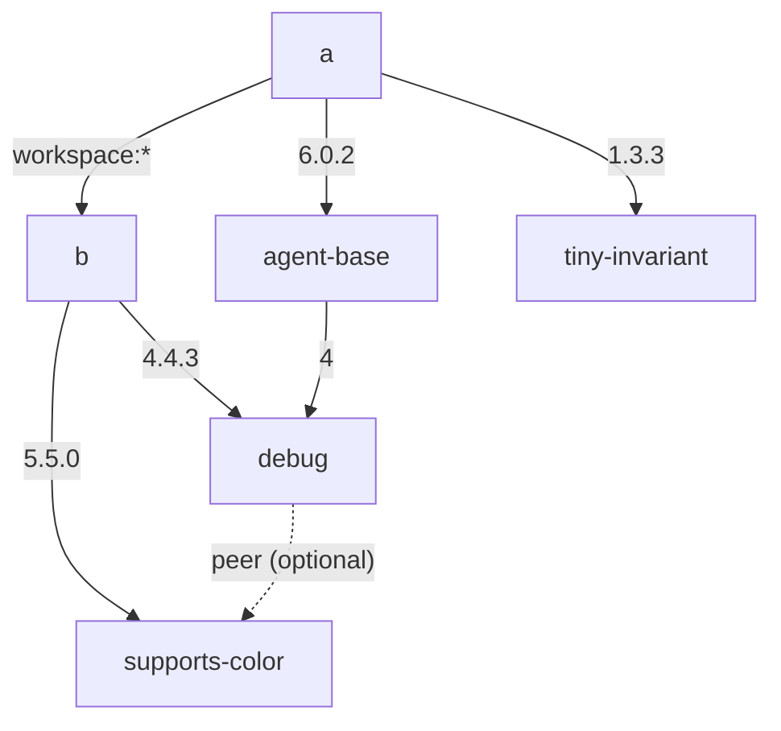

> **Suggested title:** Regression (since 11.5.2): `pnpm install` over-propagates an optional transitive peer onto unrelated packages after a manifest edit — disagreeing with `pnpm dedupe`

### Last pnpm version that worked

11.5.1

### pnpm version

11.9.0 (still reproduces in the latest release)

### Code to reproduce the issue

Minimal reproduction: https://github.com/astegmaier/playground-pnpm-lockfile-drift-bug

A tiny pnpm workspace with two packages, `a` and `b`, with the following dependency graph:



The lockfile produced for this monorepo by the initial `pnpm install` has a snapshot for `agent-base` that looks like this:

```yaml
  agent-base@6.0.2:
    dependencies:
      debug: 4.4.3(supports-color@5.5.0)
    transitivePeerDependencies:
      - supports-color
```

Steps:

1. Remove the `"tiny-invariant": "1.3.3"` dependency from `a/package.json`.
2. Run `pnpm install`.

### Expected behavior

`pnpm install` should make the minimal lockfile changes necessary to reflect the removal of `tiny-invariant`.

### Actual behavior

`pnpm install` adds a peer suffix to `agent-base` that is unrelated to the edit. Running `pnpm dedupe` _after_ `pnpm install` will clean up these extra suffixes.

```yaml
  agent-base@6.0.2(supports-color@5.5.0): ## <-- BUG: the peer suffix is incorrectly added
    dependencies:
      debug: 4.4.3(supports-color@5.5.0)
    transitivePeerDependencies:
      - supports-color
```

This seems like a small problem in this reproduction, but in our real-life monorepo, this causes hundreds of unnnecessary lockfile edits on every manifest change. 

The issue can be worked around with `pnpm dedupe`, but we're having difficulty using `pnpm dedupe` in CI because of performance issues (it takes ~5 minutes to run).

### Additional information

**Regression range.** Bisected with corepack over the lockfile-v9 range:

- ✅ **11.5.1** — last good (`install` and `dedupe` agree)
- ❌ **11.5.2** — first bad (regression appears; still present through the current **11.9.0**)

**Likely responsible change:** [#12083](https://github.com/pnpm/pnpm/pull/12083) — *"fix(deps-resolver): prefer locked peer contexts during resolution by default"* (commit `1c73e8303c`), the only peer-resolver change in the `v11.5.1..v11.5.2` range and the first bullet of the [11.5.2 release notes](https://github.com/pnpm/pnpm/releases/tag/v11.5.2). It makes a writable `pnpm install` reuse the peer contexts already recorded in the lockfile; for an *optional* peer that re-propagates the provider onto additional consumers.

**Root cause detail.** `pnpm install` reuses the previous lockfile's per-package `dependencies`/`optionalDependencies` blocks during re-resolution (`currentResolvedDependencies` in `resolveChildren`, `installing/deps-resolver/src/resolveDependencies.ts`), feeding the already-bound optional peer back in and re-propagating it. `pnpm dedupe` first clears those blocks via `forgetResolutionsOfAllPrevWantedDeps` (`installing/deps-installer/src/install/index.ts`), so it binds the optional peer only where genuinely visible. Forcing `currentResolvedDependencies = undefined` in `install` makes it match `dedupe` exactly.

**Repro note.** The **victim** must be a real registry package — the bug duplicates its snapshot (`agent-base@6.0.2` → `agent-base@6.0.2(supports-color@5.5.0)`), and workspace importers (symlinked singletons) never get that per-context peer suffix. The **binder** can be a local workspace package, since its only role is to nest `debug`+`supports-color` so the bound `debug@4.4.3(supports-color@5.5.0)` snapshot exists.

### Node.js version

24.16.0

### Operating System

- [x] macOS
- [ ] Windows
- [ ] Linux
