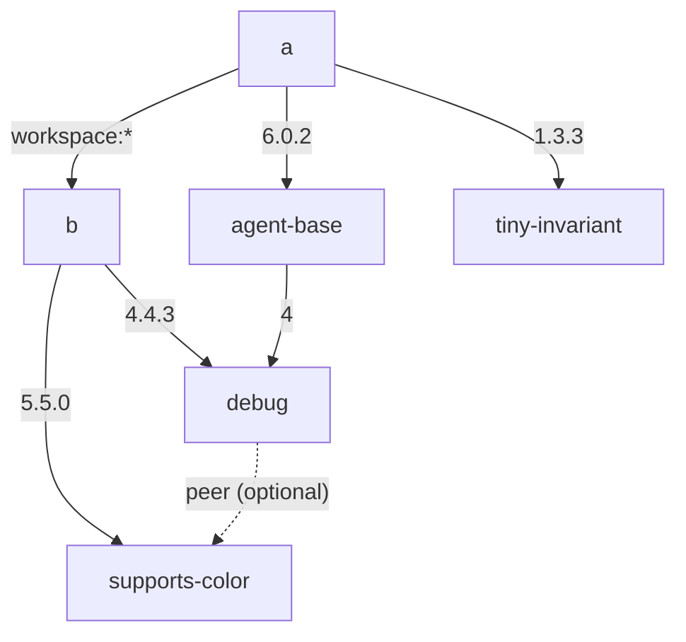

> **Suggested title:** `pnpm install` and `pnpm dedupe` disagree — `install` over-propagates an optional transitive peer onto unrelated packages after a manifest edit

### Verify latest release

- [x] I verified that the issue exists in the latest pnpm release

### pnpm version

11.9.0

### Which area(s) of pnpm are affected? (leave empty if unsure)

Peer dependency resolution / lockfile (`pnpm install` vs `pnpm dedupe`)

### Link to the code that reproduces this issue or a replay of the bug

https://github.com/astegmaier/playground-pnpm-lockfile-drift-bug

### Reproduction steps

A tiny pnpm workspace with two packages, `a` and `b` (the root `package.json` is empty). Every `dependencies` / `peerDependencies` edge between the packages — solid arrows are `dependencies` (labelled with the version range), the dashed arrow is `debug`'s **optional** `supports-color` peer:



The exact manifests:

#### `pnpm-workspace.yaml`

```yaml
packages:
  - 'a'
  - 'b'
```

#### `a/package.json`

```json
{
  "name": "a",
  "dependencies": {
    "b": "workspace:*",
    "agent-base": "6.0.2",
    "tiny-invariant": "1.3.3"
  }
}
```

#### `b/package.json`

A self-documenting local package whose only job is to put `debug` and `supports-color` side by side, so `debug` binds the optional peer one level below `a`:

```json
{
  "name": "b",
  "dependencies": {
    "debug": "4.4.3",
    "supports-color": "5.5.0"
  }
}
```

#### The relevant real-package relationship

`debug` declares `supports-color` as an **optional** peer:

```json
{
  "name": "debug",
  "peerDependencies": { "supports-color": "*" },
  "peerDependenciesMeta": { "supports-color": { "optional": true } }
}
```

`supports-color@5.5.0` is provided in the graph by the local `b` package, which depends on **both** `debug` and `supports-color@5.5.0`, so its `debug` legitimately binds the optional peer (`debug@4.4.3(supports-color@5.5.0)`).

`agent-base@6.0.2` is an ordinary `debug` consumer (it depends on *nothing but* `debug`), completely unrelated to `tiny-invariant`. `tiny-invariant@1.3.3` is a dependency-free package with no relationship to `debug` or `supports-color`.

#### Steps

The committed `pnpm-lock.yaml` is `pnpm dedupe`-stable. Then:

1. `pnpm install` — no change (the lockfile is a fixed point; `agent-base` is plain).
2. Remove the `"tiny-invariant": "1.3.3"` line from `a/package.json`.
3. `pnpm install` — `agent-base` (unrelated to the edit) **gains** a `(supports-color@5.5.0)` suffix.
4. `pnpm dedupe` — the suffix is **removed** again.

(`./scripts/reproduce.sh` in the repo runs steps 1–4 automatically.)

#### Actual `pnpm-lock.yaml` (after step 3, `pnpm install`)

```yaml
importers:
  a:
    dependencies:
      agent-base:
        specifier: 6.0.2
        version: 6.0.2(supports-color@5.5.0)   # <-- install added the optional-peer suffix

snapshots:
  agent-base@6.0.2(supports-color@5.5.0):      # <-- and a second, suffixed snapshot
    dependencies:
      debug: 4.4.3(supports-color@5.5.0)
    transitivePeerDependencies:
      - supports-color
```

#### Expected `pnpm-lock.yaml` (what `pnpm dedupe` produces from the same input — step 4)

```yaml
importers:
  a:
    dependencies:
      agent-base:
        specifier: 6.0.2
        version: 6.0.2

snapshots:
  agent-base@6.0.2:
    dependencies:
      debug: 4.4.3(supports-color@5.5.0)
    transitivePeerDependencies:
      - supports-color
```

### Describe the Bug

`pnpm install` and `pnpm dedupe` produce **different** lockfiles from the same project. Removing one dependency (`tiny-invariant`) that has nothing to do with `agent-base` and running `pnpm install` propagates the optional `supports-color` peer onto `agent-base` — it gains a `(supports-color@5.5.0)` suffix and a second snapshot. `pnpm dedupe` on the identical input does not. In `agent-base`'s snapshot, `supports-color` stays a `transitivePeerDependency` either way; `install` additionally hoists it into the package's own peer suffix, where `dedupe` keeps it absorbed.

The drift is **deterministic** (not a timing race) and surfaces only on re-resolution: a no-edit `pnpm install` reproduces the committed lockfile with 0 churn, so both forms are install fixed points — but any manifest edit forces `install` to re-propagate the optional peer. The practical consequence is that a committed, `pnpm dedupe`-stable lockfile **cannot be maintained with `pnpm install` alone**: every manifest edit re-introduces optional-peer churn on unrelated packages (in a large monorepo this was ~130 packages / hundreds of lines), and only a follow-up `pnpm dedupe` removes it.

Root cause appears to be that `pnpm install` reuses the previous lockfile's per-package `dependencies`/`optionalDependencies` blocks during re-resolution (`currentResolvedDependencies` in `resolveChildren`, `installing/deps-resolver/src/resolveDependencies.ts`), feeding the already-bound optional peer back in and re-propagating it onto additional consumers. `pnpm dedupe` first clears those blocks via `forgetResolutionsOfAllPrevWantedDeps` (`installing/deps-installer/src/install/index.ts`), so it binds the optional peer only where genuinely visible. Forcing `currentResolvedDependencies = undefined` in `install` makes it match `dedupe` exactly.

Note: the **victim** must be a real registry package — the bug duplicates its snapshot (`agent-base@6.0.2` → `agent-base@6.0.2(supports-color@5.5.0)`), and workspace importers (symlinked singletons) never get that per-context peer suffix. The **binder** can be a local workspace package, since its only role is to nest `debug`+`supports-color` so the bound `debug@4.4.3(supports-color@5.5.0)` snapshot exists.

### Expected Behavior

`pnpm install` should produce the same lockfile as `pnpm dedupe` for the same input — and, in particular, should not add a peer suffix to packages that are unrelated to the edit. A committed `pnpm dedupe`-stable lockfile should stay stable across `pnpm install` after manifest edits, instead of re-propagating optional peers that `pnpm dedupe` then removes.

### Which Node.js version are you using?

24.16.0

### Which operating systems have you used?

- [x] macOS
- [ ] Windows
- [ ] Linux

### If your OS is a Linux based, which one it is? (Include the version if relevant)

_No response_
