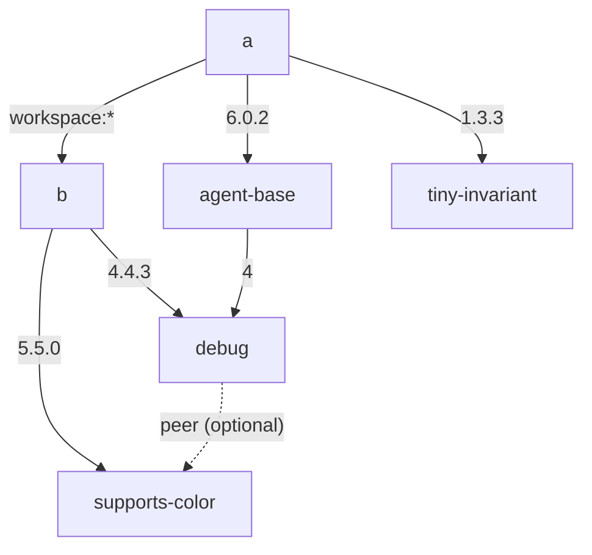

# pnpm `install`-vs-`dedupe` optional-peer lockfile drift

A **minimal, deterministic** reproduction of
**[pnpm/pnpm#12756](https://github.com/pnpm/pnpm/issues/12756)**, where `pnpm install`
and `pnpm dedupe`, run on the **same** edited project, produce **different**
`pnpm-lock.yaml` files — `install` spuriously propagates an **optional** transitive peer
(`supports-color`, the optional peer of `debug`) onto packages unrelated to the edit.

This is the small-scale version of lockfile churn seen in a large monorepo at
Microsoft, where removing one internal library from two manifests and running
`pnpm install` rewrote **417 lockfile lines** — 134 unrelated packages gaining a
`(supports-color@5.5.0)` suffix — that `pnpm dedupe` would not have produced.

Reproduces with the current **`pnpm@11.9.0`**; it is a regression introduced in
`pnpm@11.5.2` (see [Regression history](#regression-history-version-bisection)).

---

## Repro Steps

The project is a tiny pnpm workspace with two packages, `a` and `b` (the root
`package.json` is empty). The graph below shows every `dependencies` /
`peerDependencies` edge between them — see `a/package.json` and `b/package.json`
for the exact manifests:



Solid arrows are `dependencies` (labelled with the version range); the dashed
arrow is `debug`'s **optional** `supports-color` peer.

`./scripts/reproduce.sh` runs these steps for you:

**1. Remove the unrelated dependency** — delete the `"tiny-invariant": "1.3.3"`
line from `a/package.json`.

**2. Install.** `agent-base` wrongly gains a `(supports-color@5.5.0)` suffix:

```bash
pnpm install
grep -c 'supports-color@5.5.0)' pnpm-lock.yaml   # was 3, now 5
grep 'agent-base@6.0.2(' pnpm-lock.yaml          # agent-base@6.0.2(supports-color@5.5.0):
```

**3. Dedupe.** It removes the suffix `install` just added — proving it was spurious:

```bash
pnpm dedupe
grep -c 'supports-color@5.5.0)' pnpm-lock.yaml   # back to 3
grep 'agent-base@6.0.2(' pnpm-lock.yaml          # (nothing — plain again)
```

Removing `tiny-invariant` has nothing to do with `agent-base`, yet `pnpm install`
suffixes it and `pnpm dedupe` does not. That disagreement is the bug. (Without the
edit, `pnpm install` changes nothing — the lockfile is a fixed point; only the edit
triggers the drift, exactly the real-world symptom.)

---

## Root cause

`pnpm install` reuses the **previous lockfile's per-package `dependencies` /
`optionalDependencies` blocks** during re-resolution; `pnpm dedupe` throws them
away first. For an *optional* peer, keeping those blocks re-propagates the peer
onto additional (deeper) consumers.

The two relevant pieces of pnpm source (paths relative to the pnpm repo,
`installing/deps-resolver` & `installing/deps-installer`):

1. **`deps-resolver/src/resolveDependencies.ts`** (`resolveChildren`):

   ```ts
   const currentResolvedDependencies = (dependencyLockfile != null)
     ? {
       ...dependencyLockfile.dependencies,
       ...dependencyLockfile.optionalDependencies,   // includes  supports-color: 5.5.0
     }
     : undefined
   const resolvedDependencies = parentPkg.updated ? undefined : currentResolvedDependencies
   // ...passed as  preferredDependencies: currentResolvedDependencies  and  resolvedDependencies
   ```

   The preserved `optionalDependencies` (the bound `supports-color`) make the
   provider visible to additional `debug` occurrences during the re-resolution,
   so they bind the optional peer too → the suffix propagates onto unrelated
   `debug` consumers (`agent-base` here, and in the real monorepo
   `jest-environment-jsdom`, `jsdom`, `webpack-dev-server`, `madge`, `spdy`, …).

2. **`deps-installer/src/install/index.ts`** — `pnpm dedupe` sets `dedupe: true`,
   which calls **`forgetResolutionsOfAllPrevWantedDeps`**:

   ```ts
   // clear every PackageSnapshot's dependencies / optionalDependencies so the
   // newly resolved deps are always used
   wantedLockfile.packages = mapValues(
     ({ dependencies, optionalDependencies, ...rest }) => rest,
     wantedLockfile.packages)
   ```

   This deletes the blocks that piece #1 would otherwise reuse, so `dedupe`'s
   fresh resolution binds the optional peer only where it is genuinely visible —
   the minimal, canonical set.

### Proof (instrumented pnpm)

Gating piece #1 behind an env flag that forces `currentResolvedDependencies =
undefined` (i.e. making `install` behave like `dedupe`'s `forgetResolutions`)
collapses the drift exactly:

| run (canonical + edit) | suffix positions |
| --- | --- |
| `pnpm install` | **5** |
| `pnpm install` with `currentResolvedDependencies` forced `undefined` | **3** |
| `pnpm dedupe` | 3 |

The identical experiment in the large monorepo gives **200 → 66** (and `dedupe` → 66).
Same code path, same fix.

---

## Regression history (version bisection)

This bug is a **regression introduced in `pnpm@11.5.2`**. It is not present in any
earlier release; every version from `11.5.2` through the current `11.9.0` reproduces it.

Method: for each version the `packageManager` field was pinned (corepack), then
`scripts/test-version.sh` restored the canonical lockfile, removed `tiny-invariant`,
ran `pnpm install` then `pnpm dedupe`, and counted `supports-color@5.5.0)` suffix
positions. "Reproduced" = `install` yields **5**, `dedupe` yields **3**;
"clean" = both yield **3**. A binary search over the lockfile-v9 range
(`9.0.0` … `11.9.0`) located the boundary:

| pnpm version | install | dedupe | result |
| --- | --- | --- | --- |
| 9.0.0 | 3 | 3 | ✅ clean |
| 10.0.0 | 3 | 3 | ✅ clean |
| 11.0.0 | 3 | 3 | ✅ clean |
| 11.5.0 | 3 | 3 | ✅ clean |
| **11.5.1** | 3 | 3 | ✅ clean (last good) |
| **11.5.2** | 5 | 3 | ❌ **reproduced (first bad)** |
| 11.5.3 | — | — | (bracketed by 11.5.2 / 11.6.0) |
| 11.6.0 | 5 | 3 | ❌ reproduced |
| 11.7.0 | 5 | 3 | ❌ reproduced |
| 11.9.0 | 5 | 3 | ❌ reproduced |

> Note: the bisection is scoped to the **lockfile-v9** era (`pnpm@9.0.0`+). Older
> releases (`pnpm@8` and below) write a different lockfile format, so the
> `supports-color@5.5.0)` suffix count is not comparable and they were not tested.

### Introducing change

The regression was introduced by pnpm
**[PR #12083](https://github.com/pnpm/pnpm/pull/12083) — *"fix(deps-resolver): prefer
locked peer contexts during resolution by default"*** (commit
[`1c73e8303c`](https://github.com/pnpm/pnpm/commit/1c73e8303c6eefca27e9803b94e8c063eb32cfa8),
merged 2026-06-02, first shipped in `pnpm@11.5.2`). It is the only peer-resolver
change in the `v11.5.1..v11.5.2` commit range and is the first bullet of the
[`pnpm@11.5.2` release notes](https://github.com/pnpm/pnpm/releases/tag/v11.5.2):

> *Peer dependency resolution now reuses the peer contexts already recorded in the
> lockfile when those providers are still present in the dependency graph and still
> satisfy the peer ranges.*

The PR's own summary: *"When a lockfile already records multiple valid peer contexts,
pnpm keeps those contexts instead of collapsing them into one compatible context."*
That lockfile-peer-context reuse is exactly the "reuse the previous lockfile's
per-package `dependencies` / `optionalDependencies` blocks" behavior described under
[Root cause](#root-cause) — for an *optional* peer it re-propagates the provider onto
additional consumers, which `pnpm dedupe` (which forgets those blocks first) does not.

---

## Practical consequence

A committed `pnpm dedupe`-stable lockfile cannot be maintained with `pnpm install`
alone: any manifest edit makes `install` re-propagate optional peers onto unrelated
packages, and only a follow-up `pnpm dedupe` removes the churn. The drift is
**deterministic** (not a timing race) and specific to **optional** peer dependencies
— a genuine `install`-vs-`dedupe` disagreement, where each command is internally
stable but the two produce different lockfiles from the same input.

---

## Files

| path | purpose |
| --- | --- |
| `a`, `b` | the two workspace packages — `a` (victim + trigger) and `b` (the `debug`+`supports-color` binder); the root `package.json` is empty |
| `canonical/pnpm-lock.yaml` | the committed, `dedupe`-stable reference lockfile |
| `pnpm-lock.yaml` | working copy (kept equal to the canonical reference) |
| `scripts/reproduce.sh` | runs the install-vs-dedupe comparison end to end |

## Notes

- **The victim must be a real registry package.** The bug duplicates the victim's
  snapshot (`agent-base@6.0.2` → `agent-base@6.0.2(supports-color@5.5.0)`); workspace
  importers are symlinked singletons and never get that per-context peer suffix. The
  **binder**, however, *can* be a local workspace package — its only job is to nest
  `debug`+`supports-color` so the bound `debug@4.4.3(supports-color@5.5.0)` snapshot
  exists (that snapshot is a registry-package snapshot regardless of its parent).
- `node_modules/` is git-ignored.
- `PM="pd" ./scripts/reproduce.sh` runs the repro against a custom pnpm binary
  (e.g. a different pnpm build) instead of the pinned `pnpm@11.9.0`.
